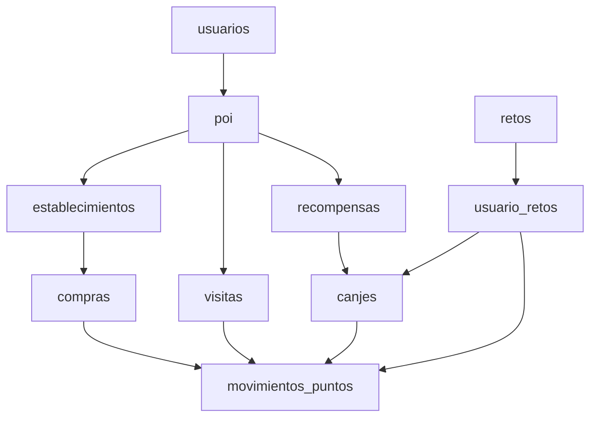
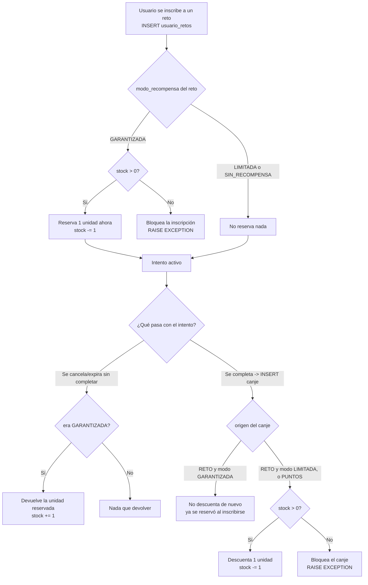
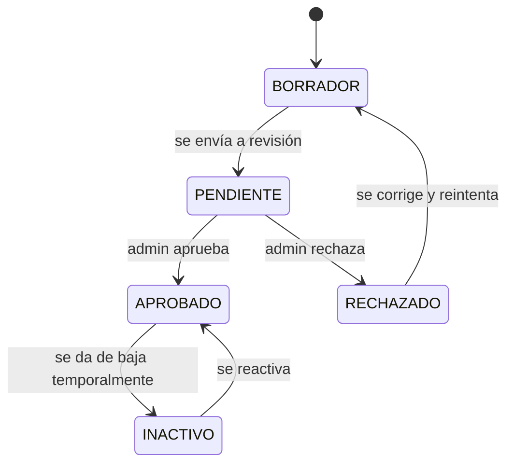
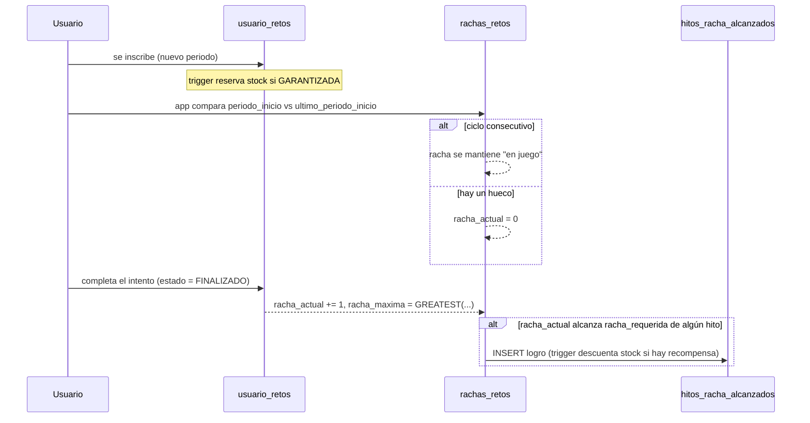

# TOURPOINTS — Lógica de negocio y flujos de trabajo

> Documentación derivada de `schem_posgrest.sql`. Describe qué hace cada módulo, qué invariantes garantiza la base de datos (CHECKs, triggers, columnas generadas) y cómo fluyen los procesos de negocio de punta a punta. No describe endpoints ni código de aplicación — esos viven fuera de este repositorio.

## Índice

1. [Resumen del dominio](#resumen-del-dominio)
2. [Módulo 1 — Identidad](#módulo-1--identidad)
3. [Módulo 2 — Ubicación](#módulo-2--ubicación)
4. [Módulo 3 — Categorías](#módulo-3--categorías)
5. [Módulo 4 — POI (entidad central)](#módulo-4--poi-entidad-central)
6. [Módulo 5 — Relaciones entre POIs](#módulo-5--relaciones-entre-pois)
7. [Módulo 6-9 — Contenido social](#módulo-6-9--contenido-social)
8. [Módulo 10-13 — Comercial](#módulo-10-13--comercial)
9. [Módulo 14 — Visitas](#módulo-14--visitas)
10. [Módulo 15-18 — Gamificación](#módulo-15-18--gamificación)
11. [Canjes](#canjes)
12. [Movimientos de puntos (ledger)](#movimientos-de-puntos-ledger)
13. [Módulo 21 — IA conversacional](#módulo-21--ia-conversacional)
14. [Flujos de negocio de punta a punta](#flujos-de-negocio-de-punta-a-punta)
15. [Invariantes garantizados por la base de datos](#invariantes-garantizados-por-la-base-de-datos)
16. [Convenciones transversales](#convenciones-transversales)
17. [Decisiones abiertas / pendientes](#decisiones-abiertas--pendientes)

---

## Resumen del dominio

TOURPOINTS es una app de turismo gamificado: los usuarios descubren **POIs** (puntos de interés — plazas, museos, negocios aliados...), los visitan físicamente, compran en establecimientos aliados y completan **retos**, todo lo cual otorga **puntos** que luego se **canjean** por **recompensas**. El POI es la entidad central del dominio: todo lo demás (comentarios, calificaciones, favoritos, compras, visitas, recompensas) cuelga de él, no de "establecimiento" como concepto separado.

---

## Módulo 1 — Identidad

**Tablas:** `roles`, `usuarios`

- `roles` es un catálogo simple (ADMIN, USUARIO, ESTABLECIMIENTO serían valores típicos, no vienen precargados en el DDL).
- `usuarios.estado` (`ACTIVO`/`SUSPENDIDO`/`ELIMINADO`) controla si la cuenta puede operar; `deleted_at` es un soft-delete independiente del `estado` (permite reactivar sin perder historial).
- `configuracion` (JSONB) guarda preferencias no estructuradas: idioma, tema, notificaciones.
- `updated_at` se mantiene solo con trigger (`trg_usuarios_updated_at`) — nunca lo escribe la aplicación directamente.

**Regla de negocio clave:** un usuario puede tener múltiples relaciones con establecimientos (ver `establecimiento_usuarios`), es decir, el mismo login puede ser "turista" y "administrador de un negocio aliado" a la vez — el rol de negocio no vive únicamente en `usuarios.rol_id`.

---

## Módulo 2 — Ubicación

**Tablas:** `paises` → `departamentos` → `ciudades` (jerarquía estricta de 3 niveles, cada uno con `UNIQUE` sobre `(padre, nombre)` para evitar duplicados).

Es un catálogo geográfico de apoyo — el POI no usa estas tablas para "dónde está" (eso lo resuelve `poi.ubicacion` con PostGIS), sino para agrupar/filtrar por ciudad en listados y reportes.

---

## Módulo 3 — Categorías

**Tabla:** `categorias_poi` — catálogo plano (Museo, Restaurante, Plaza, Parqueadero...) con `icono` y `color` para la UI. Un POI tiene exactamente una categoría (`poi.categoria_id NOT NULL`).

---

## Módulo 4 — POI (entidad central)

**Tabla:** `poi`

Es el corazón del dominio. Todo POI:

- Tiene una **ubicación geográfica real** (`GEOGRAPHY(Point,4326)`, PostGIS) usada para validar visitas por GPS.
- Tiene un **ciclo de vida de moderación**: `BORRADOR → PENDIENTE → APROBADO | RECHAZADO`, con `INACTIVO` como estado de baja temporal. Este mismo enum (`poi_estado_enum`) se reutiliza en `establecimientos`, `promociones` y `recompensas` (ver [decisiones abiertas](#decisiones-abiertas--pendientes)).
- Tiene una **fuente** (`poi_fuente_enum`: ADMIN, ESTABLECIMIENTO, USUARIO, IA) — permite distinguir un POI creado por un admin de uno sugerido por un usuario o generado automáticamente por IA, útil para decidir qué tan estricta debe ser la moderación.
- Tiene un **radio de validación** (`radio_validacion`, metros, default 50) — es la distancia máxima permitida entre el usuario y el POI para que una visita por GPS se considere válida.
- Tiene un **nivel jerárquico** (`nivel`) que **se calcula solo**: representa la profundidad de este POI dentro del grafo de `poi_relaciones` de tipo jerárquico (ver módulo 5). No lo escribe la aplicación.
- `horarios` y `metadata` son JSONB de forma libre (horarios por día, wifi/parking/pet_friendly/precio_promedio...) — no están validados por schema, solo indexados con GIN para búsquedas.

**Regla de negocio:** solo un POI en estado `APROBADO` debería ser visible públicamente (esto lo aplicará la política RLS cuando se implemente — ver memoria de roles/RLS — hoy no hay ninguna restricción de visibilidad a nivel de base de datos).

**Auditoría de moderación (`poi_moderaciones`):** tabla agregada después de esta revisión original del schema (migración de Alembic `5e0ac9f7b8ed`), no reflejada acá hasta ahora. Registra cada transición de estado del POI — `poi_id`, `usuario_id` que la disparó, `estado_anterior`, `estado_nuevo`, `motivo` opcional, `created_at` — sea que la dispare el dueño (enviar a revisión, reintentar tras un rechazo) o un ADMIN (aprobar/rechazar/activar/inactivar). Es append-only: nunca se actualiza ni se borra una fila, igual que `poi_relaciones`. `ON DELETE CASCADE` hacia `poi` (si el POI se borra físicamente, su historial de auditoría se va con él — igual criterio que el contenido social del módulo 6-9, no el de un ledger).

---

## Módulo 5 — Relaciones entre POIs

**Tablas:** `tipos_relacion_poi`, `poi_relaciones`

Este módulo modela un **grafo** entre POIs, no una jerarquía fija de tabla. Un tipo de relación declara sus propias reglas:

| Flag en `tipos_relacion_poi` | Significa | Ejemplo de `nombre` |
|---|---|---|
| `es_jerarquica = true` | Origen "contiene" a destino (afecta `poi.nivel`) | `CONTIENE`, `PERTENECE_A` |
| `es_bidireccional = true` | No importa quién es origen/destino | `CERCA_DE`, `RECOMENDADO_CON` |
| `requiere_orden = true` | El campo `orden` de la relación es obligatorio (informativo — no hay CHECK que lo obligue hoy) | `RUTA_INCLUYE` |

Cada fila de `poi_relaciones` tiene vigencia temporal (`vigencia_inicio`/`vigencia_fin`): las relaciones **no se borran**, se cierran poniendo `vigencia_fin`, y `activo` es una bandera rápida de filtro para no tener que comparar fechas en cada consulta.

**Trigger automático (`fn_actualizar_nivel_poi`):** cada `INSERT`/`UPDATE`/`DELETE` sobre una relación jerárquica recalcula `poi.nivel` del **destino** como `MIN(nivel de los orígenes activos, tratando NULL como 0) + 1`. Si ya no queda ninguna relación jerárquica activa apuntando a ese POI, `nivel` vuelve a `NULL`. *Limitación conocida:* solo recalcula el destino directo de la fila que cambió — no propaga en cascada a "nietos" más profundos en el grafo; eso requeriría un job recursivo aparte.

---

## Módulo 6-9 — Contenido social

**Tablas:** `imagenes_poi`, `comentarios`, `calificaciones`, `favoritos`

- `imagenes_poi.principal` marca la foto de portada (no hay CHECK que garantice que solo haya una `principal=true` por POI — es responsabilidad de la aplicación).
- `comentarios.estado` sigue moderación simple (`PENDIENTE/APROBADO/RECHAZADO`), igual que POI pero con su propio enum (`comentario_estado_enum`) — aquí sí está separado correctamente, a diferencia de `poi_estado_enum`.
- `calificaciones` limita 1 calificación por usuario por POI (`UNIQUE(usuario_id, poi_id)`) y fuerza el rango 1-5.
- `favoritos` es una tabla puente pura (PK compuesta, sin `id` propio).

**Todas** estas tablas tienen `ON DELETE CASCADE` hacia `poi`: si un POI se borra físicamente (no solo `deleted_at`), su contenido social desaparece con él — es dato secundario, no ledger.

---

## Módulo 10-13 — Comercial

**Tablas:** `establecimientos`, `establecimiento_usuarios`, `compras`, `promociones`

- `establecimientos` es una **extensión 1:1 de `poi`** (`poi_id UNIQUE NOT NULL`): un establecimiento no duplica nombre/dirección/ubicación, esos viven en `poi`. Solo agrega lo empresarial: `nit`, `razon_social`, `fecha_afiliacion`.
- `establecimiento_usuarios` resuelve "quién administra este negocio" — relación muchos-a-muchos con `cargo` libre (dueño, gerente, staff...).
- `compras` registra transacciones con **moneda explícita** (`moneda_enum`: COP/USD) y un ciclo de cancelación auditado: si `estado = CANCELADA`, **obligatoriamente** debe quedar quién canceló y cuándo (`cancelada_por`/`fecha_cancelacion`); si no está cancelada, esos campos deben estar vacíos — lo fuerza un `CHECK`, no la aplicación.
- `promociones` tiene vigencia obligatoria (`inicio`/`fin`, con `CHECK (fin > inicio)`) y reutiliza `poi_estado_enum` para su propio ciclo de aprobación (mismo punto pendiente que en POI).

---

## Módulo 14 — Visitas

**Tabla:** `visitas`

Una visita es el "check-in" de un usuario en un POI. Se valida por uno de tres métodos (`metodo_validacion_enum`):

- **GPS**: compara `ubicacion_usuario` contra `poi.ubicacion`; `distancia_metros` y `precision_metros` quedan registrados para auditoría (¿estaba dentro del `radio_validacion` del POI, con qué margen de error del GPS?).
- **QR**: el usuario escanea un código físico en el sitio — no depende de geolocalización.
- **MIXTA**: combina ambas señales.

El resultado de la validación es `visita_estado_enum` (`PENDIENTE/VALIDADA/RECHAZADA`) — una visita no otorga puntos hasta quedar `VALIDADA` (esa transición y su disparo hacia `movimientos_puntos` es responsabilidad de la aplicación; la base de datos no tiene un trigger que lo automatice).

*Nota:* no hay `CHECK` que obligue a que `ubicacion_usuario`/`distancia_metros` estén presentes cuando `metodo_validacion = 'GPS'` — es una validación que hoy vive solo en la aplicación.

---

## Módulo 15-18 — Gamificación

Es el módulo más grande e interconectado. Piezas, en orden de declaración:

### `reglas_puntos`
Catálogo de reglas configurables vía JSONB (`{"evento":"VISITA","categoria":"Museo","puntos":120}`) con `prioridad` y vigencia opcional. Es el "motor de reglas" que la aplicación consulta para decidir cuántos puntos otorgar ante cada evento — la base de datos solo la almacena y la referencia desde `movimientos_puntos.regla_id` para trazabilidad, no la interpreta.

### `recompensas`
El catálogo de premios canjeables. `poi_id` es **nullable a propósito**: no toda recompensa depende de un aliado comercial (ej. un parqueadero público, entradas a un evento en una plaza) — esto está confirmado como decisión de diseño, no como asunción pendiente. `stock` nunca puede ser negativo (`CHECK stock >= 0`) y se descuenta exclusivamente a través de triggers (nunca por escritura directa de la app), ver más abajo.

### `retos`
Define la plantilla de un desafío: tipo (`VISITA`/`COMPRA`/`RECORRIDO`), recurrencia (`UNICA`/`DIARIA`/`SEMANAL`/`MENSUAL`) y modo de recompensa:

| `modo_recompensa` | Significa |
|---|---|
| `SIN_RECOMPENSA` | Solo otorga puntos/insignias vía hitos, sin premio físico (`recompensa_id` debe ser NULL) |
| `GARANTIZADA` | El premio se **reserva al inscribirse** (`recompensa_id` obligatorio) |
| `LIMITADA` | El premio se disputa al completar, sin reserva previa (`recompensa_id` obligatorio) |

Si `recurrencia = UNICA`, `inicio`/`fin` son las fechas exactas del reto. Si es recurrente, `inicio`/`fin` son la **ventana de vigencia** durante la cual el reto se repite — cada ciclo puntual de cada usuario vive en `usuario_retos`, no aquí.

Un reto puede nacer de un **establecimiento aliado** (`establecimiento_id` lleno) en vez de un admin — en ese caso nace en `BORRADOR` hasta que un admin lo apruebe (`ACTIVO`) o lo rechace (`CANCELADO`).

### `usuario_retos`
Cada fila es **un intento dentro de un periodo específico** — no "el reto que tiene el usuario", sino "este ciclo puntual". Para un reto `UNICA` el periodo coincide con `retos.inicio/fin`; para uno recurrente, la aplicación calcula `periodo_inicio`/`periodo_fin` al inscribir (ej. `date_trunc('week', now())` para uno semanal), y cada ciclo nuevo es una **fila nueva** — la tabla `retos` nunca se toca por esto.

`numero_intento` permite reintentar **dentro del mismo periodo** tras un intento fallido, conservando el historial. Un índice único parcial (`idx_usuario_retos_intento_activo`) garantiza que solo puede haber **un intento `ACTIVO`** por `(usuario, reto, periodo)` a la vez — pero sí permite que convivan un `ACTIVO` de la semana actual y uno ya `FINALIZADO`/`CANCELADO` de la semana pasada.

### `sesiones_reto`
Solo para retos tipo `RECORRIDO`: guarda el marco (`inicio`/`fin`/`estado`) de una sesión de tracking en vivo. El tracking GPS punto-a-punto en sí vive en Redis mientras la sesión está en curso — esta tabla es el registro persistente, no el stream.

### `rachas_retos`
Vive **separada** de `usuario_retos` porque una racha cruza múltiples periodos y no tiene sentido guardarla en una fila que representa un solo ciclo. Como no hay job automático que reinscriba al usuario cada periodo, la aplicación es responsable de mantenerla en dos momentos:

1. **Al unirse a un nuevo periodo:** compara `periodo_inicio` contra `ultimo_periodo_inicio`. Si son ciclos consecutivos, la racha sigue "en juego"; si hay un hueco, `racha_actual` se resetea a 0 antes de sumar el nuevo intento.
2. **Al finalizar un periodo:** `racha_actual += 1`, `racha_maxima = GREATEST(racha_maxima, racha_actual)`.

### `insignias` + `hitos_racha` + `hitos_racha_alcanzados`
`insignias` es el catálogo real de badges (id, código único, nombre, descripción, icono). `hitos_racha` define, por reto, "al llegar a **racha_requerida** veces seguidas, se desbloquea X" — combinación libre de `puntos_bonus`, `recompensa_id` e `insignia_id` (las tres son opcionales, se usa la que aplique).

`hitos_racha_alcanzados` es el log de cada vez que un usuario alcanza un hito. **A propósito no tiene `UNIQUE`** sobre usuario+hito: si la racha se rompe y se vuelve a alcanzar, el hito se otorga de nuevo. La columna `recompensa_otorgada` indica si, en esa ocurrencia puntual, hubo stock disponible para entregar el premio físico (ver trigger abajo) — el logro **nunca se bloquea** por falta de stock, solo se registra sin premio.

---

## Canjes

**Tabla:** `canjes`

Representa el cambio de una recompensa por su costo en puntos, o su entrega automática al completar un reto. `origen` (`PUNTOS`/`RETO`) determina cuál de los dos flujos aplicó, y un `CHECK` obliga la coherencia: si `origen = RETO`, `usuario_reto_id` debe estar lleno; si `origen = PUNTOS`, debe estar vacío. `codigo_qr` es el código único que el usuario presenta físicamente para redimir, y `fecha_expira`/`fecha_redencion` controlan su ciclo de vida (`PENDIENTE → REDIMIDO | EXPIRADO`).

---

## Movimientos de puntos (ledger)

**Tabla:** `movimientos_puntos`

Es el **libro mayor** de puntos: append-only, nunca se actualiza ni se borra una fila existente. Cada movimiento debe originarse en **exactamente una** de cuatro fuentes posibles — se fuerza con `CHECK (num_nonnulls(visita_id, compra_id, usuario_reto_id, canje_id) = 1)`, no por convención de la aplicación:

| FK informada | Significa |
|---|---|
| `visita_id` | Puntos por check-in validado |
| `compra_id` | Puntos por compra registrada |
| `usuario_reto_id` | Puntos por completar (o hito de) un intento de reto — referencia al **intento**, no al reto genérico |
| `canje_id` | Puntos negativos por redimir una recompensa |

`tipo_movimiento` es una **columna generada** (`GENERATED ALWAYS ... STORED`) derivada de cuál de las cuatro FKs está llena — elimina cualquier posibilidad de que la app declare un tipo que no coincida con la FK real. `regla_id` es solo trazabilidad (qué regla de `reglas_puntos` decidió el monto).

**El saldo nunca se guarda como columna.** Se calcula siempre con `SUM(puntos)` — la vista `saldo_puntos_usuario` lo expone ya agregado por usuario. Si el volumen crece, la sugerencia explícita en el DDL es convertirla en `MATERIALIZED VIEW` con `REFRESH` periódico.

### Triggers de disponibilidad por stock

Estos tres triggers son el corazón de la integridad de inventario del sistema — garantizan que nunca se prometa o entregue más de lo que existe, sin bloquear procesos que no dependen de stock:

1. **`fn_reservar_o_bloquear_reto`** (`BEFORE INSERT ON usuario_retos`): si el reto es `GARANTIZADA`, reserva 1 unidad de `recompensas.stock` de inmediato (con `SELECT ... FOR UPDATE` para evitar condiciones de carrera) o bloquea la inscripción si ya no hay. Si es `LIMITADA`, no hace nada — el riesgo se resuelve después.
2. **`fn_liberar_reserva_si_no_completa`** (`AFTER UPDATE ON usuario_retos`, cuando `estado` pasa de `ACTIVO` a `CANCELADO`): devuelve al stock la unidad reservada si el reto era `GARANTIZADA` — evita que abandonar un intento pierda inventario para siempre.
3. **`fn_expirar_retos_vencidos`**: función pensada para un cron (`pg_cron` o externo, sugerido cada hora) que pasa a `CANCELADO` los intentos `ACTIVO` cuyo `periodo_fin` ya pasó — esto es lo que dispara el punto 2 para los que nadie completó a tiempo.
4. **`fn_descontar_stock_canje`** (`BEFORE INSERT ON canjes`): descuenta stock atómicamente **excepto** cuando el canje viene de un reto `GARANTIZADA` (esa unidad ya se descontó al inscribirse — descontarla de nuevo duplicaría el gasto). Para `LIMITADA` sí valida/descuenta aquí: si ya no hay stock al completar, el `INSERT` del canje falla — es responsabilidad de la aplicación revisar la vista `retos_disponibilidad` antes de intentarlo, y si no hay stock, omitir el canje y entregar solo los puntos (nunca bloquear la finalización del reto en sí).

El mismo principio ("nunca bloquear el logro, solo omitir el premio físico si no hay stock") se repite en **`fn_otorgar_recompensa_hito`** (`BEFORE INSERT ON hitos_racha_alcanzados`): si el hito alcanzado tiene `recompensa_id`, intenta descontar stock; si lo logra, marca `recompensa_otorgada = true`, si no, `false` — pero el logro (puntos/insignia) siempre se registra.

La vista **`retos_disponibilidad`** existe exactamente para que el frontend muestre "agotado" sin tener que repetir este JOIN/CASE en cada consulta.

---

## Módulo 21 — IA conversacional

**Tabla:** `conversaciones_ia`

Log de interacciones con un asistente de IA (probablemente para recomendaciones de POIs o soporte). Cada fila es un turno de conversación (`role`: USER/ASSISTANT/SYSTEM) con metadatos de observabilidad: `modelo`, `tokens`, `temperatura`, `latencia_ms`, `costo_usd`, `finish_reason`. `session_id` agrupa los turnos de una misma conversación; el acceso típico ("toda la sesión, en orden") está indexado explícitamente (`idx_conversaciones_ia_session`).

---

## Flujos de negocio de punta a punta

### 1. Aprobación de un POI

### 2. Visita (check-in) y puntos

1. Usuario intenta check-in en un POI → `INSERT visitas` (`estado = PENDIENTE`).
2. Validación por GPS (distancia vs. `poi.radio_validacion`), QR o mixta.
3. Si queda `VALIDADA`, la aplicación decide los puntos (consultando `reglas_puntos`) e inserta un `movimientos_puntos` con `visita_id` lleno.
4. El saldo del usuario se refleja automáticamente vía `saldo_puntos_usuario` (`SUM` en tiempo real, o materializada si el volumen lo exige).

### 3. Reto recurrente con racha

### 4. Canje de una recompensa

1. La app valida contra la vista `retos_disponibilidad` (o el `stock` directo) si conviene intentar el canje.
2. `INSERT canjes` con `origen` correcto (`PUNTOS` o `RETO`).
3. El trigger `fn_descontar_stock_canje` decide si descuenta stock (según el caso GARANTIZADA/LIMITADA/PUNTOS explicado arriba).
4. Si el canje es por `PUNTOS`, la app inserta además un `movimientos_puntos` negativo con `canje_id` lleno, para reflejar el gasto en el ledger.
5. El usuario presenta `codigo_qr` físicamente → `estado` pasa a `REDIMIDO` (o `EXPIRADO` si venció `fecha_expira` sin uso).

---

## Invariantes garantizados por la base de datos

Esta tabla distingue lo que **la base de datos fuerza sola** (no puede romperse aunque la aplicación tenga un bug) de lo que sigue siendo responsabilidad de la aplicación:

| Invariante | Mecanismo | Tabla |
|---|---|---|
| Un movimiento de puntos tiene exactamente un origen | `CHECK num_nonnulls(...) = 1` | `movimientos_puntos` |
| `tipo_movimiento` siempre coincide con la FK llena | Columna `GENERATED ALWAYS` | `movimientos_puntos` |
| Nunca hay dos intentos `ACTIVO` del mismo reto+periodo | Índice único parcial | `usuario_retos` |
| Reto `GARANTIZADA`/`LIMITADA` siempre tiene `recompensa_id`; `SIN_RECOMPENSA` nunca | `CHECK` | `retos` |
| Canje `RETO` siempre tiene `usuario_reto_id`; `PUNTOS` nunca | `CHECK` | `canjes` |
| Compra `CANCELADA` siempre tiene auditor+fecha; el resto nunca | `CHECK` | `compras` |
| `stock` nunca queda negativo | `CHECK stock >= 0` + triggers atómicos (`FOR UPDATE`) | `recompensas` |
| `poi.nivel` siempre refleja el grafo jerárquico vigente | Trigger `fn_actualizar_nivel_poi` | `poi` / `poi_relaciones` |
| `updated_at` siempre refleja la última modificación | Trigger `fn_set_updated_at` | `usuarios`, `poi`, `rachas_retos` |
| Racha nunca negativa; máxima nunca menor que la actual | `CHECK` | `rachas_retos` |
| Vigencia de relaciones/promociones/reglas coherente (`fin > inicio`) | `CHECK` | `poi_relaciones`, `promociones`, `reglas_puntos`, `retos`, `usuario_retos`, `sesiones_reto` |

**Responsabilidad exclusiva de la aplicación (sin respaldo de la base de datos hoy):**
- Que una visita `GPS` realmente traiga `ubicacion_usuario`/`distancia_metros`.
- Mantener `rachas_retos` al día (no hay trigger automático, está documentado como decisión deliberada).
- Que `imagenes_poi` tenga a lo sumo una fila `principal = true` por POI.
- Que `requiere_orden = true` en un tipo de relación realmente implique `orden IS NOT NULL` en `poi_relaciones`.
- Visibilidad pública de POIs/comentarios según `estado` (hoy no hay RLS — ver más abajo).

---

## Convenciones transversales

- **IDs:** `UUID` para entidades expuestas públicamente por API (usuarios, poi, compras, retos...); `SMALLSERIAL`/`SERIAL`/`BIGSERIAL` para catálogos internos de bajo volumen (roles, países, ciudades, categorías) — evita el costo de UUID donde no aporta nada.
- **Tiempos:** siempre `TIMESTAMPTZ`, nunca `TIMESTAMP` sin zona.
- **Soft delete:** `deleted_at` en `usuarios` y `poi` — el resto de tablas no lo necesita porque cuelgan de estas dos o son ledger append-only.
- **JSONB:** se usa para datos verdaderamente variables por fila (`horarios`, `metadata`, `configuracion`, `progreso`, `configuracion` de reglas/retos) y siempre con índice `GIN` cuando se espera filtrar por su contenido. No reemplaza columnas cuando el dato es fijo y consultable (eso sigue siendo columna normal).
- **Enums vs. texto libre:** todo estado de ciclo de vida es `ENUM` dedicado, excepto la reutilización deliberada (o pendiente de separar) de `poi_estado_enum` entre POI/establecimientos/promociones/recompensas.

---

## Decisiones abiertas / pendientes

1. **Separar `poi_estado_enum`** en enums propios por entidad (`establecimiento_estado_enum`, `promocion_estado_enum`, `recompensa_estado_enum`) — hoy funciona porque los valores son genéricos, pero mezcla semánticas de ciclo de vida distintas (¿qué significa "RECHAZADO" para una promoción?). Requiere decidir primero qué estados tiene sentido que tenga cada entidad — es una decisión de producto, no un cambio mecánico.
2. **Roles y políticas RLS** para exponer este schema vía PostgREST/Neon Data API. Ya hay un plan acordado (3 roles: `anon`/`authenticated`/`service_role`, autorización por fila vía RLS, escrituras sensibles solo a través de funciones `SECURITY DEFINER`) pendiente de implementar cuando se retome la integración con Neon.
